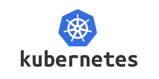
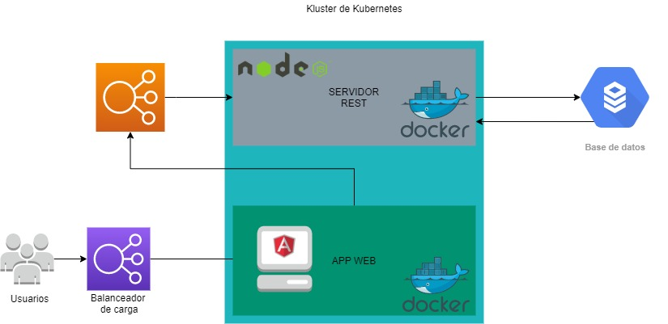
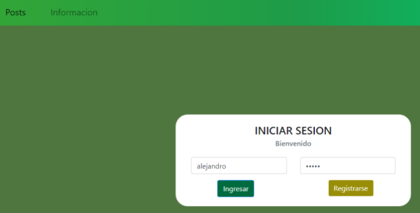
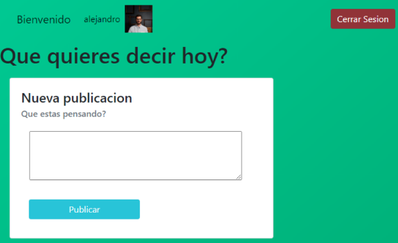
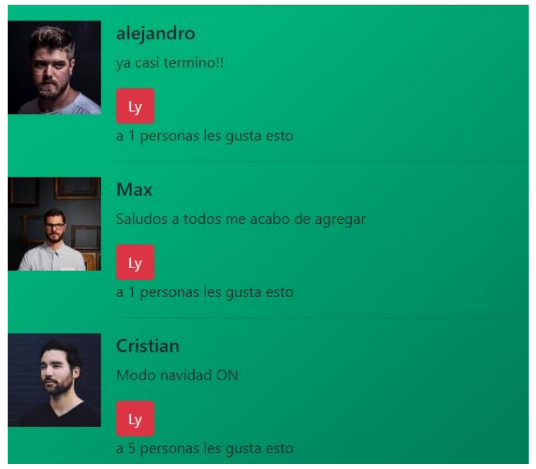

# SocialFriends
##  Solucion a un problema en la clase de sistemas operativos 1

Durante el examen final de sistemas operativos 1 desarrolle una aplicacion sencilla que hace uso de la nube y kubernetes para deplegar una aplicacion parecida a twitter, puedes registrarte, iniciar sesion, hacer publicaciones, ver las publicaciones de los demas y darles me gusta.

# Herramientas utilizadas

# Direccion de la aplicacion
## (Desabilitado) http://34.66.232.206

## Diagrama de la arquitectura de la aplicacion

### Inicio de sesion

### Nueva publicacion 

### Publicaciones de amigos

